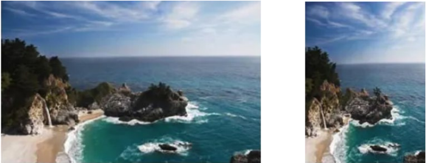
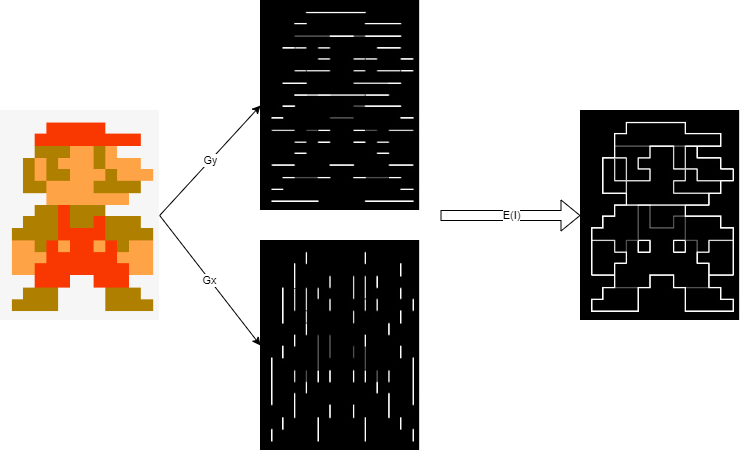
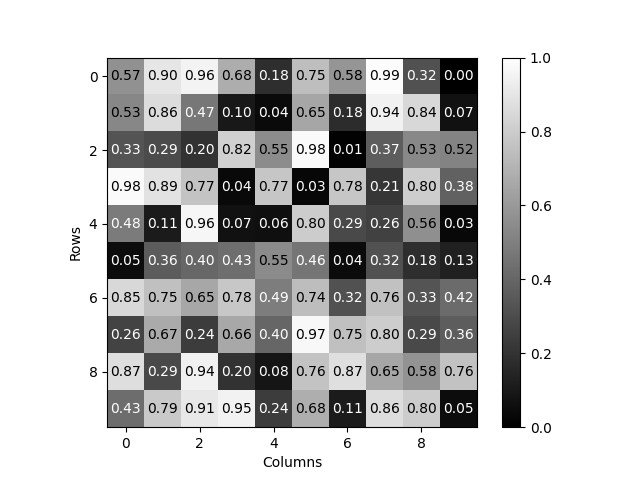
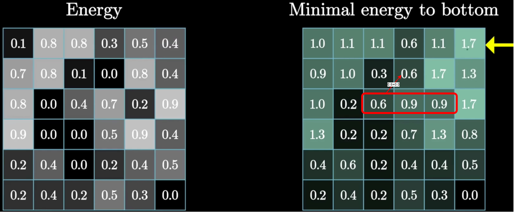
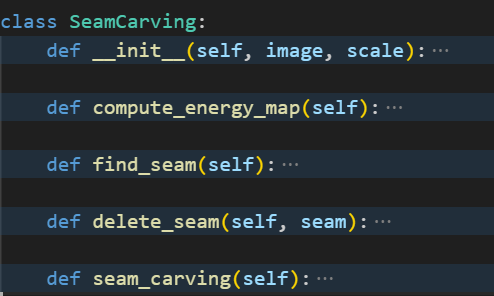
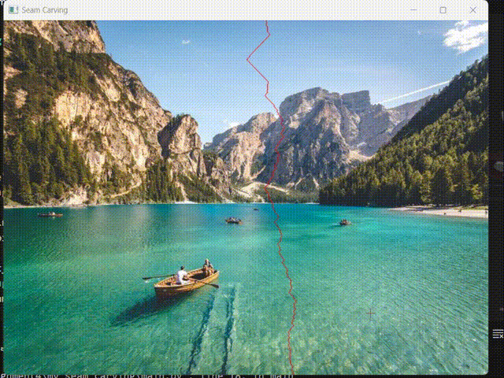
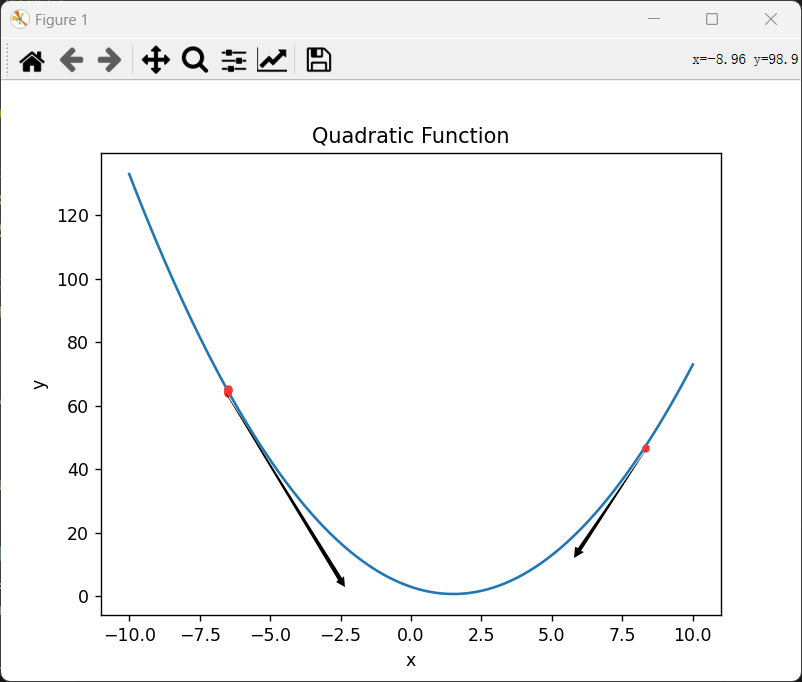
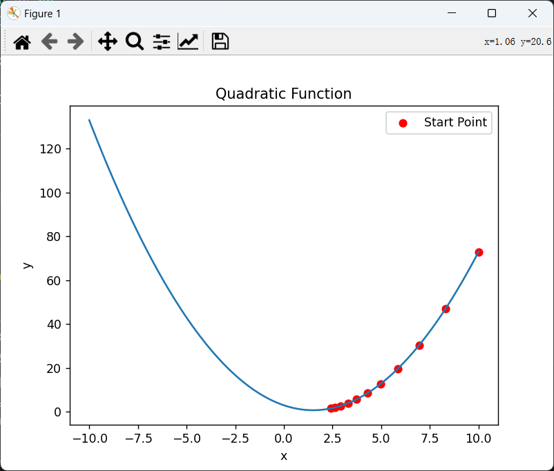
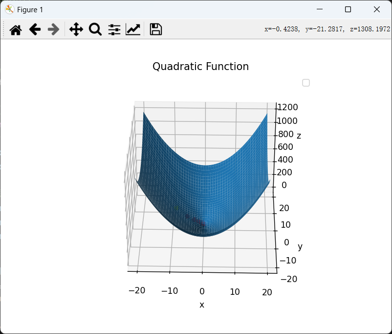
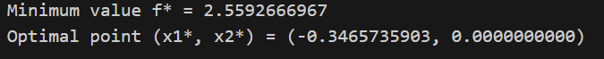

# 算法题

## 1.最短路径数量 

### Question:

​		国际象棋中的车可以水平或竖直移到棋盘中同行或同列的任何一格。将车从棋盘的一角移到另一对角，有多少条最短路径？路径的长度由车所经过的方格数（包括第一格和最后一格）来度量。使用下列方法求解该问题:

+  动态规划算法 
+  基本排列组合

### Solution:

+ 动态规划

**$dp[i][j]$表示从$(0,0)$到$(i,j)$的路径数**

方程为：
$$
dp[i][j] = dp[i - 1][j] + dp[i][j - 1];
$$
初始条件为：
$$
dp[i][0]=dp[0][j]=1
$$

|  1   |  1   |  1   |  1   |  1   |  1   |  1   |    1     |
| :--: | :--: | :--: | :--: | :--: | :--: | :--: | :------: |
|  1   |  2   |  3   |  4   |  5   |  6   |  7   |    8     |
|  1   |  3   |  6   |  10  |  15  |  21  |  28  |    36    |
|  1   |  4   |  10  |  20  |  35  |  56  |  84  |   120    |
|  1   |  5   |  15  |  35  |  70  | 126  | 210  |   330    |
|  1   |  6   |  21  |  56  | 126  | 252  | 462  |   792    |
|  1   |  7   |  28  |  84  | 210  | 462  | 924  |   1716   |
|  1   |  8   |  36  | 120  | 330  | 792  | 1716 | ==3432== |

```c++
for (int i = 0; i < row; i++)
    for (int j = 0; j < col; j++) {
        if (i == 0 || j == 0)
            dp[i][j] = 1;
        else
            dp[i][j] = dp[i - 1][j] + dp[i][j - 1];
    }
```

+ 排列组合

从$(0,0)$到$(i,j)$走了**$i+j$**步，其中$i$步向下，$j$步向右

从$(0,0)$到$(i,j)$的路径数:

**从$i+j$步中选$i$步向下的方案数$\times$从$j$步中选$j$步向右**
$$
C_{i+j}^{i}\times C_{j}^{j}
$$
本题中一共走了7+7=14步，其中7步向下，7步向右，路径数：$C_{14}^{7}=3432$

所以有3432条最短路径

## 2.Huffman Code

### a.

对下面的数据构造一套哈夫曼编码

| 字符     | A    | B    | C    | D    | -    |
| -------- | ---- | ---- | ---- | ---- | ---- |
| 出现概率 | 0.4  | 0.1  | 0.2  | 0.15 | 0.15 |


| 字符       | A    | B    | C    | D    | -    |
| ---------- | ---- | ---- | ---- | ---- | ---- |
| 哈夫曼编码 | 0    | 100  | 111  | 101  | 110  |

### b.

用 a 中的编码对文本 ABACABAD 进行编码

**0100011101000101**

### c.

对于 100010111001010 用 a 中的编码进行解码 

100 0 101 110 0 101 0

**BAD-ADA**

# 编程题

## 1.

### Question:

**Seam Carving** 算法是一种处理图像缩放的算法，可以尽可能的保持图像中的 **“重要区域”**的比例，避免由于直接缩放造成的“失真”，效果如下图：



+ 算法的原理是计算每个像素点的梯度（可以将图像视为离散型的函数，此时在 x 方向上的梯度 可以简化为相邻像素点的差值，y 方向同理，该像素点的梯度为了简便运算，可以使用 x 和 y 方向的 梯度绝对值之和代替，当然这只是计算梯度的一种方式，在 OpenCV 中定义了多种算子进行梯度计 算，如 Sobel 算子，具体的实现可以参考已实现的算法）作为该像素点的“能量”。然后在对应 方向上寻找能量最小的一条缝隙（路径），进行删除。

+ 缩放算法的步骤可以总结如下:

1. 计算像素点能量； 
2. 找到相应方向上能量最小的路径，称为 seam; 
3. 移除 seam，得到新图像
4. 重复执行步骤 1 到步骤 3，n 次，得到缩放后的图像。 其中，查找最小能量路径的问题可以看作是最短路径问题，将每个像素视为一个节 点，像素$(i, j)$与上方$(i-1, j-1)(i-1, j)(i-1, j+1)$和下方$(i+1, j-1)(i+1, j)(i+1, j+1)$相连通，此时问题就转换为求从第一行像素出发到最后一行像素的能量最短路径。可以使用**动态规划**方法进行高效求解。Seam Carving 算法还可以进行图像放大，目标保护和去除等应用，感兴趣的同学可以自行拓展。

+ 要求：实现 Seam Carving 算法的图像缩放功能（其他功能不做加分处理）并横向缩放一张图片为原图的**二分之一**，编程语言不限。除寻找能量最小路径的算法需要自行完成外，其余可以参考已实现的算法。 

+ 提交内容：源码；说明文档（包含 Usage, 寻找能量最小路径算法的时间复杂度和空间复杂度）；缩放前和缩放后的图像(任意)；不需要可执行文件；打包成文件夹命名为 code1

### Solution:

1. 计算图像得出图像的能量图

原理：首先灰度化，然后进行水平和垂直方向的卷积计算
$$
G_x=∣I∗K_x∣\\
G_y=∣I∗K_y∣\\
E(I)=∣G_x∣+∣G_y∣
$$
$K_x$ 和 $K_y$ 是 Sobel 算子的卷积核，$I \ast K_x$ 表示图像 $I$ 与卷积核 $K_x$ 进行卷积运算，$| \cdot |$ 表示取绝对值。
$$
G_x = \left| \begin{array}{ccc}
-1 & 0 & 1 \\
-2 & 0 & 2 \\
-1 & 0 & 1 \\
\end{array} \right| * I \\
G_y = \left| \begin{array}{ccc}
-1 & -2 & -1 \\
0 & 0 & 0 \\
1 & 2 & 1 \\
\end{array} \right| * I
$$




可以看出，边缘和变化明显处的能量高，而平缓、不突出处的能量低

```python
def compute_energy_map(self):
    gray = cv2.cvtColor(self.image, cv2.COLOR_BGR2GRAY)
    gradient_x = cv2.Sobel(gray, cv2.CV_64F, 1, 0, ksize=3)
    gradient_y = cv2.Sobel(gray, cv2.CV_64F, 0, 1, ksize=3)
    energy_map = np.abs(gradient_x) + np.abs(gradient_y)
    return energy_map
```

2. 使用动态规划计算出能量最少的路径（注释:贪心算法无法找到整体最优的路径）

这是能量图中的部分数据



我们水平缩放时，选择从下至上(或者从上至下)进行路径选择



计算出表格之后从下到上找到路径

```python
def find_seam(self):
    energy_map = self.compute_energy_map()
    rows, cols = energy_map.shape
    dp = np.zeros_like(energy_map, dtype=np.float64)
    dp[0] = energy_map[0]

    for i in range(1, rows):
        for j in range(cols):
            if j == 0:
                dp[i, j] = energy_map[i, j] + min(dp[i-1, j], dp[i-1, j+1])
            elif j == cols - 1:
                dp[i, j] = energy_map[i, j] + min(dp[i-1, j-1], dp[i-1, j])
            else:
                dp[i, j] = energy_map[i, j] + min(dp[i-1, j-1], dp[i-1, j], dp[i-1, j+1])

     seam = []
     j = np.argmin(dp[-1])
     seam.append((rows - 1, j))

     for i in range(rows - 2, -1, -1):
         if j == 0:
             j = np.argmin(dp[i, j:j+2])
         elif j == cols - 1:
             j = np.argmin(dp[i, j-1:j+1]) + j - 1
         else:
             j = np.argmin(dp[i, j-1:j+2]) + j - 1
         seam.append((i, j))

     return seam
```

3. 删除所选能量最小的路径

```python
def delete_seam(self, seam):
    rows, cols, _ = self.image.shape
    new_image = np.zeros((rows, cols-1, 3), dtype=np.uint8)

    for i, j in seam:
        new_image[i] = np.delete(self.image[i], j, axis=0)

	return new_image
```

4. 重复2-3过程

#### 复杂度

首先分析每个函数的时空复杂度



| Function               | Time Complexity    | Space Complexity |
| :--------------------- | ------------------ | ---------------- |
| `compute_energy_map()` | O(M*N)             | O(M*N)           |
| `find_seam()`          | O(M*N)             | O(M*N)           |
| `delete_seam()`        | O(M)               | O(M*N)           |
| `seam_carving()`       | $O((M\times N)^2)$ | O(M*N)           |

+ 时间复杂度
  + `compute_energy_map()`: 该方法中使用了`cv2.Sobel`函数进行图像梯度计算，其时间复杂度为O(M*N)，其中M和N分别是图像的高度和宽度
  + `find_seam()`: 该方法中使用了两个嵌套的循环来计算动态规划表，时间复杂度为O(M*N)
  + `delete_seam()`: 该方法中使用了`np.delete`函数删除像素，时间复杂度为O(M)
  + `seam_carving()`:每次调用`find_seam()`、`delete_seam()`等方法时，时间复杂度为O(M*N)，总体时间复杂度取决于迭代次数$O((M\times N)^2)$
  
+ 空间复杂度
  + `compute_energy_map()`: 创建了灰度图像和梯度图像，所以需要额外的空间来存储这些图像，空间复杂度为O(M*N)
  + `find_seam()`: 创建了动态规划表`dp`，空间复杂度为O(M*N)
  + `delete_seam()`: 创建了新图像`new_image`，空间复杂度为O(M*N)
  + `seam_carving()`:除了调用其他方法所需的空间外，还需要存储当前图像的副本。假设输入图像的大小为M×N，则空间复杂度为O(M*N)。

所以代码的时间复杂度为：$O((M\times N)^2)$

空间复杂度为：$O(M\times N)$

#### 如何运行代码？

first

`pip install opencv-python`

`pip install numpy`

on the terminal

`python main.py`

#### 运行实例：



original:


output:


## 2.

### Question:

​		在求解复杂最优化问题，尤其是非凸函数时，常常无法通过直接计算导数为 0 来计算出最值点，此时，经常会用到梯度下降法来代替，梯度下降法的思想是通过将一步计算分解成多步计算，不断迭代进行近似求解。具体方法为设置一个初始位置 $x_0$，在当前位置选择下一步的迭代方向和步长，移动到新的位置$x_1$，继续在当前位置选择下一步的迭代方向和步长，重复迭代 n 次，得到近似最优解$x_n$。显而易见，迭代方向和步长的选择是影响梯度下降法效果的重要因素。对于这一问题，梯度下降法选择的是**贪心算法**的思想，即找到当前位置下降最快的方向作为下一步的迭代方向。

​		对于可微函数而言，梯度方向的负方向就是当前点下降最快的方向，正是基于这一原因， 将其命名为梯度下降法。梯度下降法的迭代公式为$x^{k+1} = x^k − t∇f(x)$，其中$∇f(x)$是 当前点的梯度，𝑡是步长(学习率)，迭代预先设定的迭代次数 n 后，就得到了算法的解，当然，一般也会设定一个阈值$𝜂$，当迭代前后𝒙的插值$|x_k − x_{k+1}| < 𝜂$时，也会提前退出迭代。使用不同的迭代次数 n，步长𝑡以及阈值𝜂，往往也会有不同的算法效果。现在有一个无约束的最优化问题： 
$$
𝑓(x_1, x_2) = 𝑒^{x_1+3x_2−0.1} + 𝑒^{x_1−3x_2−0.1}+ e^{−x_1−0.1}
$$
​		假设初始点位于(0, 0)，请使用梯度下降法来求出该问题的最小值$f^*$和对应的$(x_1^*,x_2^*)$。精度取到**小数点后 10 位**。编程语言不限。

​		 思考内容（不做加分处理）：对于凸函数而言，使用迭代方法最后会收敛到最小值点，而对于非凸函数，一定会收敛到最小值点吗？初始点的设置对于非凸函数极值点的求解有多大影响？一般有哪些初始点设置方法？步长又有多少影响？步长要怎样设置？梯度下降法的缺点有哪些？针对这些缺点，有哪些改进的迭代方法?

### Solution:

梯度下降法：


$$
x^{k+1} = x^k - \eta* \frac {df(x)}{x} \\\eta学习率/步长
$$
点变化的快慢———斜率（x的梯度）、$\eta$

核心：$x$朝着**导数方向的反方向**变化



多元也是一样
$$
x=x-\eta∇f(x)\\∇f(x)=
\begin{bmatrix}
\frac{\partial f}{\partial x_1} \\
\frac{\partial f}{\partial x_2} \\
\vdots \\
\frac{\partial f}{\partial x_n}
\end{bmatrix}
$$



```python
import numpy as np
x_init = np.array([0, 0]) # 初始点
learning_rate = 0.01 # 学习率
num_iterations = 2000 # 迭代次数
epsilon = 1e-10 # 阈值

# 定义目标函数
def f(x1, x2):
    return np.exp(x1 + 3*x2 - 0.1) + np.exp(x1 - 3*x2 - 0.1) + np.exp(-x1 - 0.1)

# 定义目标函数的梯度
def gradient_f(x1, x2):
    df_dx1 = np.exp(x1 + 3*x2 - 0.1) + np.exp(x1 - 3*x2 - 0.1) - np.exp(-x1 - 0.1)
    df_dx2 = 3*np.exp(x1 + 3*x2 - 0.1) - 3*np.exp(x1 - 3*x2 - 0.1)
    return np.array([df_dx1, df_dx2])

# 梯度下降法求解
def gradient_descent(x_init, learning_rate, num_iterations, epsilon):
    x = x_init
    for i in range(num_iterations):
        gradient = gradient_f(x[0], x[1])
        x_next = x - learning_rate * gradient
        if np.linalg.norm(x_next - x) < epsilon:
            break
        x = x_next
    return x, f(x[0], x[1])

# 使用梯度下降法求解
x_star, f_star = gradient_descent(x_init, learning_rate, num_iterations, epsilon)

# 输出结果
print("Minimum value f* = {:.10f}".format(f_star))
print("Optimal point (x1*, x2*) = ({:.10f}, {:.10f})".format(x_star[0], x_star[1]))
```



最小值$f^*$：2.5592666967

对应的$(x_1^*,x_2^*)$：(-0.3465735903,0.0000000000)

#### 思考内容：

​		思考内容（不做加分处理）：对于凸函数而言，使用迭代方法最后会收敛到最小值点，而对于非凸函数，一定会收敛到最小值点吗？初始点的设置对于非凸函数极值点的求解有多大影响？一般有哪些初始点设置方法？步长又有多少影响？步长要怎样设置？梯度下降法的缺点有哪些？针对这些缺点，有哪些改进的迭代方法?

1. 对于非凸函数，梯度下降法不一定会收敛到全局最小值点，而可能停留在局部最小值点或鞍点

2. 如果初始点选择得好，梯度下降法可能会收敛到全局最小值点。但是，如果初始点选择得不好，梯度下降法可能会陷入局部最小值点或鞍点，并无法找到全局最小值点。

3. 常见的初始点设置方法包括：

   + 随机初始化：随机选择一个点作为初始点。

   + 均匀采样：在搜索空间内均匀采样一些点，选择其中最好的点作为初始点。

   + 先验知识：利用先验知识选择一个较好的初始点。

4. 步长（学习率）对梯度下降法的收敛性和速度有很大影响。如果步长设置得太小，收敛速度会很慢；如果步长设置得太大，可能会导致震荡或无法收敛

5. 需要进行一些实验和调整来选择合适的步长。

6. 梯度下降法的一些缺点包括：

   + 可能陷入局部最小值点或鞍点，而无法找到全局最小值点。

   + 对于非凸函数，结果可能依赖于初始点的选择。

   + 学习率的选择对收敛性和速度有很大影响，但需要手动调整。

7. 针对这些缺点，有一些改进的迭代方法，包括：

   + 随机梯度下降法（Stochastic Gradient Descent，SGD）：使用随机样本来估计梯度，通过降低计算开销和增加随机性，有助于避免陷入局部最小值点。

   + 动量方法（Momentum）：引入动量项来加速收敛，并在平原区域上减少震荡。

   + 自适应学习率方法（Adaptive Learning Rate）：根据梯度的历史信息自动调整学习率，如AdaGrad、RMSprop和Adam等。

   + 模拟退火（Simulated Annealing）：以一定概率接受劣质解，有助于跳出局部最小值点。

   + 遗传算法（Genetic Algorithms）：利用进化算法的思想进行参数搜索，可以应用于非凸函数优化问题。
